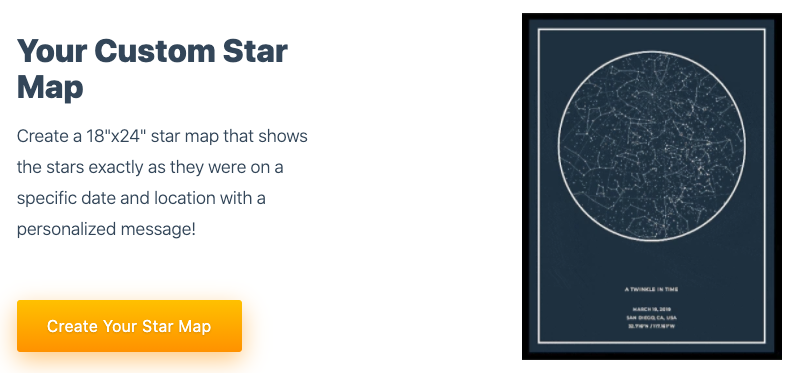

# Front-end Developer Challenge

This is a simple front-end code challenge created to serve two purposes:

1. Show off your skills,
2. Give us a better understanding of your skills.

## The Task

Recreate your own version of this hero image using [Next.js](https://nextjs.org), [React](https://reactjs.org/) & [TailwindCSS](https://tailwindcss.com/):

## Additional Instructions

* Clone this repository
* Use star map image located at `public/images/hero.png`
* Make final design responsive
* Make sure it works across all browsers (even IE11)
* Design & code what you believe would be a high converting hero component using your own design touches
* After you're done, push changes to your own public repository and provide us a link

## Bonus Points

* Use the CMS API Route (http://localhost:3000/api/cms) to retrieve the hero data dynamically and work with both SSR & browser
* Show experience with React state
* Clean code
* Tests
* Knowledge of modern best practices/coding patterns
* Clean commit history
* Deploy & send URL